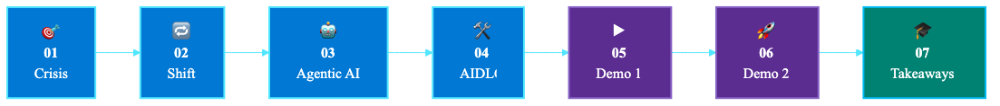
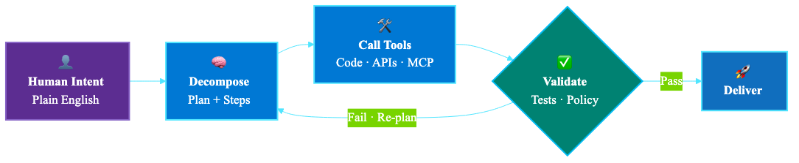
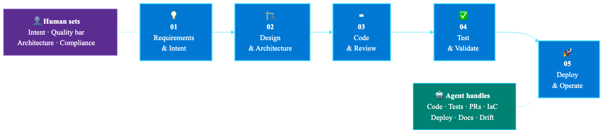
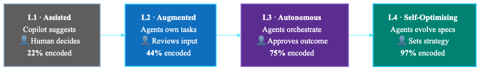
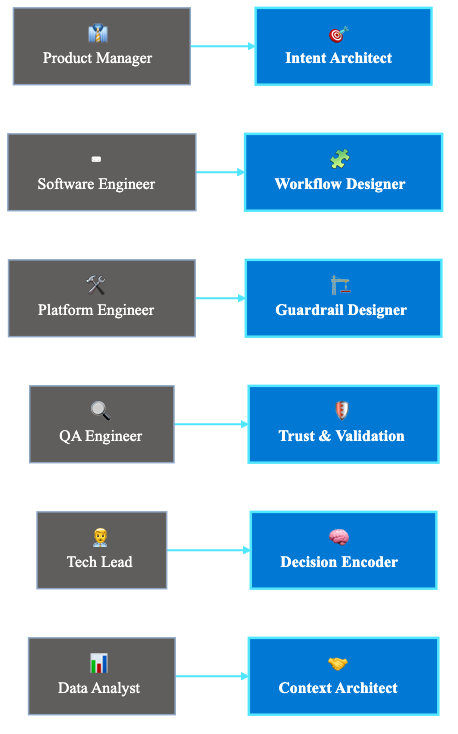
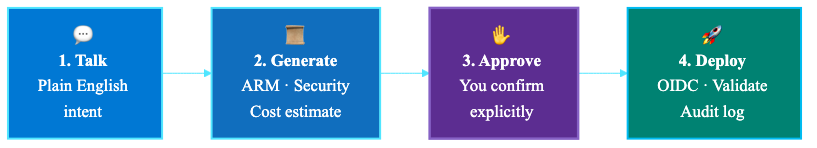
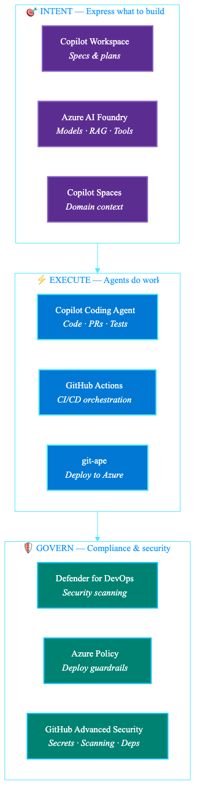
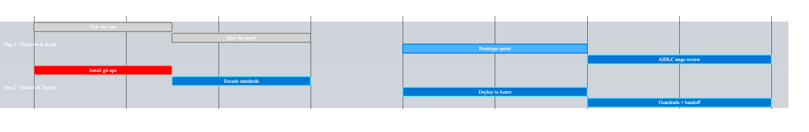

<!--
Microsoft Fluent — Customer-facing executive deck
Storyline preserved verbatim. Visuals rebranded to Microsoft brand standards:
- Fluent gradients on lead/section slides (Azure Blue → Purple → Cyan)
- Microsoft palette throughout: #0078D4, #106EBE, #5C2D91, #8661C5, #00BCF2, #008272
- Microsoft 4-square mark on title and closing slides
- Segoe UI typography, executive-confident, high-contrast
-->
---
marp: true
theme: microsoft-fluent
size: 16:9
paginate: true
math: mathjax
---

<!-- _class: lead -->

  
    
    
  
  Microsoft

Mumbai AI Day · 2025

# Build AI‑Powered Apps Faster
## Idea to Production with Agentic DevOps

**Shailesh Kumar Mishra**
GitHub Technology Sales & Consulting · AI Expert Consultant, Microsoft

⏱ &nbsp; 11:25 – 12:05 · 40 minutes · 2 live demos
🔗 &nbsp; `github.com/Azure/git-ape`

<!--
SPEAKER NOTES — Slide 1: Title

Namaste everyone! Welcome to the session. Before I start, quick show of hands — how many of you have GitHub Copilot installed? Good. How many of you have used it in the last week? OK. How many of you have complained that your manager doesn't count "Copilot wrote it" as your productivity? That's the real problem we're solving today.

My name is Shailesh. I work at the intersection of GitHub, Azure, and the question every CTO in this room is asking their team on Monday morning: "If AI is so powerful, why is the delivery still so slow?"

In the next 40 minutes, I want to show you that the problem is not AI. The problem is that we are running a 2015 process with 2025 tools. That's like buying a Formula 1 engine and putting it in a Mumbai BEST bus. The engine is capable. The system around it... not so much.

We'll do two live demos, and I want to leave you with two things you can actually do next week — not next quarter.

Let's go.
-->

---

Agenda

# 40 Minutes · 2 Demos · 1 Big Idea

<!--
SPEAKER NOTES — Slide 2: Agenda

Seven acts, 40 minutes. Think of this like a Bollywood movie — we start with a crisis, there's a hero moment in the middle, and by the end you get a working solution you can take home.

The two DEMO segments are not a recording. Not a screenshot. Not a "imagine if this worked" slide. It's live. If something breaks, that's part of the charm — because that's real engineering.

The big idea I want you to walk away with: The bottleneck in your engineering org is no longer code. It's decision-making. And AIDLC is how you systematically move decisions from people to agents — without losing control.

Let's start with the uncomfortable truth.
-->

---

<!-- _class: lead -->

The Problem

# What if your engineering culture was built for a world that **no longer exists?**

✅ &nbsp; Code is cheap now 
⚡ &nbsp; Execution is fast now 
⏳ &nbsp; <strong>Judgement is still slow</strong>

→ &nbsp; So what changed?

<!--
SPEAKER NOTES — Slide 3: The Problem

Here's the uncomfortable truth. Most engineering cultures — the rituals, the sprints, the standups, the PR reviews — were designed in a world where writing code was the bottleneck. That world ended sometime around 2023.

In 2025, code is cheap. Copilot writes it. Agents review it. Pipelines deploy it. The bottleneck has moved. It's now judgement: What should we build? How good is "good enough"? Is this compliant? Can we explain this to the regulator?

But our engineering culture hasn't caught up. We're still running 2-week sprints to decide things AI can decide in 2 minutes. We're still doing manual PR reviews on code that Copilot wrote and Copilot can review. We're still treating "velocity" as story points instead of business outcomes.

So the question becomes: if execution is solved, what is your team actually for?

The answer is: judgement. Specification. Standards. Decisions. And the org that encodes those decisions first — wins.
-->

---

The Shift

# AI Solved Execution. Decisions are where the time goes.

### ✅ AI handles this

- Writing code
- Unit tests
- PR reviews
- Deployments
- Infra provisioning
- Documentation

### ⏳ Humans still decide

- Product direction
- Architecture choices
- Quality standards
- Compliance calls
- Team alignment
- "What good looks like"

→ &nbsp; **AIDLC goal:** systematically move the right column into the left column.

<!--
SPEAKER NOTES — Slide 4: The Shift

Look at this list carefully. On the left — everything AI now does reliably. Writing code, generating tests, reviewing PRs, deploying, provisioning infra, writing docs. Five years ago, these tasks consumed 60-70% of engineering capacity. Today, agents do all of it.

On the right — what humans still do. And notice the pattern: every item is a decision, not an action. Product direction is a decision. Architecture is a decision. "What good looks like" is the most important decision you make.

Here's the insight: AIDLC is not about replacing humans. It's about systematically taking the items on the right and encoding them — as specs, as guardrails, as agent instructions — so that the next time, the agent can decide it. Not because the human is replaceable, but because the decision, once made, is now repeatable.

Every decision you encode, you free up human time for the next harder decision. That's the productivity flywheel.
-->

---

Agentic AI

# Agents don't just execute — they reason.

> Intent → Spec &nbsp; · &nbsp; Spec → Plan &nbsp; · &nbsp; Plan → Action &nbsp; · &nbsp; Action → Verify

<!--
SPEAKER NOTES — Slide 5: Agentic AI

Quick distinction. "AI" is a model that responds to a prompt. "Agent" is a system that takes intent, decomposes it into steps, calls tools, observes results, validates, and loops.

A model writes a function when you ask. An agent reads the spec, opens a PR, runs the tests, checks the security scan, fixes the lint error, asks you for approval if confidence is low, and merges. That's the difference between autocomplete and autopilot.

The four steps on screen — Intent, Decompose, Tools, Validate — that's the loop every modern coding agent runs. Copilot Coding Agent does this. GitHub Copilot Workspace does this. git-ape does this for deployments.

The mental model shift for your team: stop writing prompts, start writing intent. Stop reviewing code line-by-line, start reviewing the reasoning the agent used. That's where judgement lives now.
-->

---

AIDLC

# The Journey from Intent to Production

📊 *Maturity grows as decisions are encoded into specs.* &nbsp;&nbsp; ⚡ *Agents execute at machine speed, 24×7 — no standup needed.*

<!--
SPEAKER NOTES — Slide 6: AIDLC

This is the AIDLC — AI Development Life Cycle. Five stages, end-to-end, from a business intent to running production code.

What's different from SDLC? In classical SDLC, humans walk through every stage doing tasks. In AIDLC, humans set the inputs at each stage — intent, quality bar, architectural direction, compliance bar, approval — and agents do the work between them.

Read it left to right: Requirements & Intent. Design & Architecture. Code & Review. Test & Validate. Deploy & Operate. Each stage has a human contribution (a decision) and an agent execution (the action).

At L1 maturity, humans contribute at every stage. At L4 maturity, humans contribute only at stage 1 and stage 5 — intent in, approval out — and agents handle stages 2-4 autonomously with full audit trail.

The roadmap for your org is: which stage do you encode next? Most BFSI orgs I work with start with stage 3, Code & Review, because Copilot is already there. The high-leverage move is to encode stage 1, Requirements & Intent — that's where AIDLC compounds.
-->

---

Maturity Model

# Where is your organisation today?

→ &nbsp; **The goal of AIDLC is to move you right.**

<!--
SPEAKER NOTES — Slide 7: Maturity Model

Four levels. Find yours honestly.

L1 — Assisted. You have Copilot installed. Developers use it. You see ~20% faster code authoring. This is where most orgs are today. ~22% of decisions are AI-assisted, but humans still decide everything.

L2 — Augmented. Agents now own whole tasks — not just suggestions, but full ticket-to-PR work. Teams have started encoding standards into Copilot custom instructions. ~44% of decisions flow through encoded specs.

L3 — Autonomous. Agents orchestrate end-to-end workflows. Humans review outcomes, not inputs. 75% of standard decisions are encoded. This is where git-ape lives — humans approve, agents deliver.

L4 — Self-Optimising. Agents observe their own performance, propose process improvements, and evolve the specs themselves. Very few orgs are here. The ones who are — well, they're the ones eating the others' lunch.

Be honest. Most BFSI orgs I assess in India are at L1 with pockets of L2. The fastest path to L3 is to pick ONE workflow — deployment is a great choice — and encode it fully. That's the AIDLC engagement we offer at the end.
-->

---

The Shift

# The sprint was a ceremony for slowing down.

### 🐢 Traditional Agile

- 2-week sprint planning
- Dev → QA → Ops handoffs
- Manual PR reviews
- Humans watch the pipeline
- Standards in a wiki nobody reads
- Velocity = story points

### ⚡ Agentic DevOps

- Spec once, agents act continuously
- No handoffs — agents orchestrate
- Agent reviews at commit time
- Pipeline runs without a babysitter
- Standards encoded in agent instructions
- Velocity = business outcomes

<!--
SPEAKER NOTES — Slide 8: Sprint Ceremony

I love Agile. It saved engineering in 2005. But here's the inconvenient truth — in 2026, the 2-week sprint is a ceremony for slowing down.

Why? Because the sprint exists to batch decisions. We batch features, batch reviews, batch deploys. Why? Because humans can't think continuously. We need rituals.

Agents can. An agent reviews every commit. An agent runs the pipeline every push. An agent checks compliance every minute. The "batch" disappears when the executor is always-on.

The right-hand column isn't a future state. It's available today. Copilot Coding Agent is GA. GitHub Actions runs continuously. git-ape deploys to Azure with full validation. The only thing stopping you is the ceremony.

I'm not asking you to fire your Scrum Master. I'm asking you to ask: what ritual exists because humans were slow — and how do we replace it now that agents are fast?
-->

---

Roles

# Your team didn't shrink. The roles transformed.

<!--
SPEAKER NOTES — Slide 9: Roles Transformed

If you take one slide back to your office, take this one.

Engineers are afraid AI will replace them. Leadership is afraid AI will let them shrink the team. Both are wrong.

Look at the right column. Every role is harder than the old one. Intent Architect is harder than Product Manager — you have to write specs precise enough for an agent to act on. Decision Encoder is harder than Tech Lead — you have to formalise architectural standards that were previously tribal knowledge. Trust & Validation Lead is harder than QA Engineer — you have to verify reasoning, not just outputs.

So the message: your team's headcount may stay flat, but the value of each person on the team just went up 3-5×, because they're now operating on judgement, not execution.

This is also your talent strategy. The orgs that recognise these new roles, train for them, hire for them — they will out-execute the orgs still posting jobs for "Senior Java Developer with 8 years' experience."
-->

---

<!-- _class: lead -->

▶ Live Demo

# DEMO 1
## Idea → Prototype

<strong>1.</strong> &nbsp; State intent in plain English 
<strong>2.</strong> &nbsp; Agent generates spec + user stories 
<strong>3.</strong> &nbsp; Code + tests generated automatically 
<strong>4.</strong> &nbsp; Human reviews <strong>reasoning</strong>, not code

 

**Stack:** &nbsp; GitHub Copilot Workspace &nbsp;·&nbsp; GitHub Copilot Agent &nbsp;·&nbsp; Azure AI Foundry

<!--
SPEAKER NOTES — Slide 10: Demo 1

OK. Demo time.

What I'm going to do: take a plain English business intent — "we need a loan eligibility microservice for retail customers, RBI-compliant, with audit trails" — and watch GitHub Copilot Workspace + Copilot Agent generate a full prototype.

Not a code suggestion. A prototype. Spec, user stories, code, tests, README. All from one sentence.

The thing I want you to watch is NOT the speed. It's the reasoning. After the agent generates the code, I'll show you the decision log — every choice it made, every alternative it considered, every assumption it stated. That's the artifact you review. That's where judgement lives.

If the demo breaks — and live demos break — that's also part of the lesson. I'll show you how the agent recovers. Real engineering.
-->

---

Open Source · Azure

# git-ape: Prototype to Production. Safely.

`github.com/Azure/git-ape`

> Nothing deploys to Azure without your explicit confirmation &nbsp;·&nbsp; Every run is auditable &nbsp;·&nbsp; WAF-aligned by default

<!--
SPEAKER NOTES — Slide 11: git-ape

git-ape is open source. github.com/Azure/git-ape. Star it after the talk if you find this useful.

Four-step flow. Step 1: you talk to it in plain English — "deploy this microservice to Azure." git-ape interviews you about requirements. Region, redundancy, networking, IAM. If you don't know, it suggests defaults aligned to Azure Well-Architected Framework.

Step 2: it generates an ARM template, runs a Checkov security scan, runs a Defender for DevOps scan, computes the monthly cost, and shows you a structured report.

Step 3: nothing happens until you explicitly approve. Type "yes" — or don't. Your call.

Step 4: OIDC-authenticated deploy through GitHub Actions. Post-deploy validation runs automatically. If anything fails, automatic rollback.

The radical thing isn't the automation. It's the audit trail. Every git-ape run produces a permanent, immutable record: who asked, what was asked, what was generated, what was approved, what deployed, what validated. RBI / SEBI / DPDP audit-ready by construction.
-->

---

Security & Compliance

# Compliance is architecture, not an audit.

| Layer | Enforced at | What it controls |
|---|---|---|
| 🏛 **Azure Policy** | Deploy time | Subscription-level guardrails — no resource bypass |
| ⚙️ **GitHub Actions + Checkov** | Build time | Pre-merge security scanning of every IaC change |
| 🤖 **Copilot Agent Skills** | Generation time | Agents call only approved skills — no rogue actions |
| 📝 **Repo Custom Instructions** | Commit time | Engineering standards encoded — every PR follows them |
| 🧠 **Copilot Spaces (Context)** | Intent time | Domain context — agents reason within your business rules |

<!--
SPEAKER NOTES — Slide 12: Security & Compliance

This is the slide your CISO needs to see.

Compliance is not something you bolt on at audit time. It's something you architect into every layer. Read this bottom up — that's intent time to deploy time.

At INTENT time: Copilot Spaces gives the agent the right business context. Loan eligibility is a regulated activity in India. Customer PII is sensitive. The agent reasons within those constraints because the context is loaded.

At COMMIT time: Repo custom instructions encode your engineering standards. Every PR Copilot writes follows them automatically.

At GENERATION time: Copilot Agent Skills are an allow-list. The agent can only call skills you've sanctioned. No surprise actions.

At BUILD time: every PR runs Checkov, runs Defender for DevOps, fails the build if security policy is violated. No human reviewer needed to catch the basics.

At DEPLOY time: Azure Policy is the last gate. Even if everything above misbehaves, the policy denies the deployment. Defence in depth.

Compliance is no longer a quarterly fire drill. It's a continuous property of your engineering system.
-->

---

<!-- _class: lead -->

▶ Live Demo

# DEMO 2
## Prototype → Production

<strong>1.</strong> &nbsp; <code style="background:rgba(255,255,255,.18);padding:2px 8px;border-radius:6px;">@git-ape deploy the loan microservice</code> 
<strong>2.</strong> &nbsp; ARM template + security report + cost estimate 
<strong>3.</strong> &nbsp; GitHub Actions: Checkov + Defender scan runs 
<strong>4.</strong> &nbsp; You confirm → OIDC deploy → post-deploy validation

 

**Stack:** &nbsp; git-ape &nbsp;·&nbsp; GitHub Copilot &nbsp;·&nbsp; GitHub Actions &nbsp;·&nbsp; Azure Policy &nbsp;·&nbsp; Defender for DevOps

<!--
SPEAKER NOTES — Slide 13: Demo 2

Demo 2. Now we take the prototype from Demo 1 and ship it.

I'll talk to git-ape in a GitHub issue. "@git-ape deploy the loan microservice to azure with WAF baseline, India-South region, with audit logging enabled."

Watch what happens:

1. git-ape interviews me — asks about traffic, asks about redundancy. I answer.
2. git-ape generates an ARM template with Bicep, runs Checkov, runs Defender for DevOps, computes Azure cost. All in a comment on the issue.
3. The comment includes a security report — what policies are satisfied, what are flagged. And a structured cost estimate — month 1, month 12, with breakdown.
4. I type "yes" — or I push back with a change request.
5. GitHub Actions kicks off. OIDC authentication, no long-lived secrets. Deploy runs. Post-deploy smoke tests run.
6. The microservice is live in Azure.

Total wall-clock time from "deploy this" to running in production: 8-12 minutes for a small service. With full security and cost audit.

The point: this is what L3 maturity feels like. Humans approve. Agents deliver.
-->

---

BFSI India

# Why this matters for Indian BFSI.

🏛 &nbsp; <strong>RBI Digital Lending</strong> Guideline-compliant by construction

🔐 &nbsp; <strong>Security by Default</strong> Defender + GHAS + Azure Policy

📊 &nbsp; <strong>Full Audit Traceability</strong> Every decision, every deploy logged

🌐 &nbsp; <strong>India Region Residency</strong> Data stays in Azure India-South

⚡ &nbsp; <strong>10× Feature Velocity</strong> Sprint cycles measured in hours

👥 &nbsp; <strong>Shadow AI Governance</strong> Approved agents, audit-ready usage

<!--
SPEAKER NOTES — Slide 14: BFSI India

Six reasons this matters specifically for Indian financial services.

RBI Digital Lending Guidelines — every loan service has compliance obligations. With AIDLC, those obligations are encoded as Copilot agent skills and Azure Policy rules. The agent literally cannot generate a non-compliant loan service.

Security by Default — Defender for DevOps + GitHub Advanced Security + Azure Policy. Three layers. Always on.

Full Audit Traceability — RBI inspectors want immutable logs. git-ape produces those by default. Every deploy is an auditable artifact.

India Region Residency — Azure India South + India Central. Your customer data does not leave India. DPDP-compliant by architecture.

10× Feature Velocity — I'm not exaggerating. The orgs I've worked with measure feature cycles in hours, not weeks. Customer KYC update? 4 hours. New loan product variant? 1 day.

Shadow AI Governance — this is the silent crisis. Your developers are already using AI tools. The question is whether they're using approved ones with audit trails. AIDLC gives you the answer: yes, and here's the log.
-->

---

Technology Stack

# The full Microsoft stack behind AIDLC.

<!--
SPEAKER NOTES — Slide 15: Tech Stack

For your architects. Here's the full Microsoft + GitHub stack that powers AIDLC, organised by INTENT → EXECUTE → GOVERN.

INTENT layer — where humans express what they want. Copilot Workspace (specifications and plans), Azure AI Foundry (models + RAG + tools), Copilot Spaces (domain context).

EXECUTE layer — where agents do work. Copilot Coding Agent (code, PRs, tests), GitHub Actions (CI/CD orchestration), git-ape (deployment to Azure).

GOVERN layer — where compliance and security live. Defender for DevOps (security scanning), Azure Policy (deployment guardrails), GitHub Advanced Security (secrets, code scanning, dependency review).

You don't need to adopt the whole stack on day 1. The pattern most BFSI orgs follow: Copilot first (INTENT + EXECUTE), then GitHub Advanced Security (GOVERN), then git-ape (full pipeline), then Azure AI Foundry for domain agents (advanced INTENT).

Talk to me after the session — I'll sketch your adoption roadmap on a napkin.
-->

---

Measuring ROI

# What does success look like?

3–5×
Deployment Frequency DORA

↓ 65%
Lead Time for Changes DORA

↓ 45%
Change Failure Rate DORA

↓ 50%
MTTR DORA

Hours, not Weeks
Spec-to-Ship Cycle Time

↑ High
Developer Happiness Index

<!--
SPEAKER NOTES — Slide 16: Measuring ROI

What you don't measure, you can't mature. So here are the numbers I want you to track.

Four DORA metrics — the industry standard since 2014, refreshed for the agentic era:
- Deployment Frequency: 3-5× improvement. If you deploy weekly today, target daily. If daily, target multiple per day.
- Lead Time for Changes: 65% reduction. From idea to production. If you take 2 weeks today, target 5 days.
- Change Failure Rate: 45% reduction. The bar is: agents review more carefully than tired humans.
- MTTR — Mean Time to Recover: 50% reduction. Agents detect drift, propose fixes, even self-heal in some cases.

Two AIDLC-specific metrics:
- Spec-to-Ship Cycle Time: from approved specification to running in production. Should be measured in hours by L3 maturity.
- Developer Happiness Index: yes, this matters. Engineers doing high-judgement work are happier than engineers doing manual reviews. Track it via quarterly survey. Watch retention.

I have a measurement template I'll share with you in the workshop. Lightweight Power BI dashboard pulling from GitHub + Azure DevOps + Foundry telemetry. Set up in a day.
-->

---

How We Help

# Two engagements. Your real use case.

### 🛠 ENGAGEMENT 1
**AIDLC Workshop**
*Idea → Working Prototype*

- 1–2 day hands-on workshop
- Your real BFSI use case
- AIDLC stage-by-stage
- GitHub Copilot + AI Foundry
- **You own the prototype**

### 🚀 ENGAGEMENT 2
**git-ape Production**
*Prototype → Production*

- git-ape in your GitHub org
- WAF standards enforced
- Org policies encoded
- Security gates built in
- **Platform team owns it**

Talk to us after this session &nbsp;·&nbsp; `github.com/Azure/git-ape` &nbsp;·&nbsp; Both available as structured Microsoft / GitHub engagements.

<!--
SPEAKER NOTES — Slide 17: How We Help

Two clear offers. Both available as structured engagements.

Engagement 1 — AIDLC Workshop. Pick your team's highest-value pain point. Bring 4-6 engineers. We spend 1-2 days together. End of day 2 you walk out with a working prototype, your engineers know how to use Copilot Workspace and AI Foundry, and you have a clear AIDLC roadmap for that use case. Your prototype, your code, your IP.

Engagement 2 — git-ape Production. We bring git-ape into your GitHub org. We configure it against your Azure subscriptions, your WAF baseline, your security policies, your approval workflows. Your platform team owns it after week 1. We sit alongside for 4 weeks until it's running production deploys with zero hand-holding.

You can do Engagement 1 standalone, Engagement 2 standalone, or both — the natural sequence is workshop → production. Most clients do both, ~6 weeks apart.

Catch me after the session. Or send a note to your Microsoft / GitHub account team. We have a structured SOW for both.
-->

---

AIDLC Workshop

# 2 days · Real team · Real outcome

✅ &nbsp; **Day 2 outcomes:** &nbsp; Working prototype &nbsp;·&nbsp; git-ape in your org &nbsp;·&nbsp; Org standards encoded &nbsp;·&nbsp; Production CI/CD pipeline &nbsp;·&nbsp; AIDLC maturity baseline

<!--
SPEAKER NOTES — Slide 18: Workshop Schedule

Two days, 4 sessions each. Both days end with a working artifact you take home.

Day 1 — Discover & Build. AM session 1: pick the use case. The criterion is "highest-value pain point" — not "easiest" or "most exciting." If it doesn't matter to the business, skip it. AM session 2: translate the business goal into an agent-ready specification. This is the AIDLC art. PM session 3: prototype sprint — agents generate code, team reviews reasoning. PM session 4: AIDLC stage review — map what humans decide vs what agents handle. Identify the next decisions to encode.

Day 2 — Harden & Deploy. AM session 5: install git-ape in your GitHub org. Configure Azure MCP. Set up OIDC auth. AM session 6: encode your org's architectural standards into Copilot custom instructions. This is where the real productivity unlock starts. PM session 7: deploy the prototype from Day 1 — ARM template, security report, approval, Azure deploy. PM session 8: turn on guardrails — drift detection, CI/CD policies, runbook handoff.

End of day 2, you have everything in the green box. Working prototype in your repo. git-ape running. Standards encoded. Pipeline live. Baseline maturity score so you know where you start.

This is the fastest path from "we're thinking about AI" to "we're shipping with AI."
-->

---

Takeaways

# Remember these five things.

**1.** &nbsp; **Execution is solved.** Specification is your new competitive advantage.

**2.** &nbsp; **AIDLC encodes human decisions** into agent specs — stage by stage.

**3.** &nbsp; **GitHub Copilot + AI Foundry:** idea to prototype in minutes, not sprints.

**4.** &nbsp; **git-ape:** prototype to production with compliance built in.

**5.** &nbsp; **Measure with DORA.** What you don't measure, you can't mature.

<!--
SPEAKER NOTES — Slide 19: Takeaways

Five things. If you remember nothing else, remember these.

One. Execution is solved. Stop competing on who can write code faster — agents won that race. Compete on who can specify better. The org with sharper specifications wins.

Two. AIDLC is the method. It's not magic — it's a structured way to encode the human decisions you make every day into agent-ready specs. Stage by stage. Sustainable. Auditable.

Three. The tools exist today. Copilot Workspace, Copilot Coding Agent, AI Foundry. You don't need to wait for the next product release. Idea to prototype in minutes is available now.

Four. git-ape is open source, free, and ready. Take a prototype to production safely with full compliance audit. github.com/Azure/git-ape.

Five. Measure. DORA metrics + AIDLC-specific cycle time. Without measurement, you can't tell if you're at L1, L2, or L3. With measurement, you can show the CFO why the next investment pays.

That's it. Build with intent. Ship with confidence. Measure what matters.
-->

---

<!-- _class: lead -->

  
    
    
  
  Microsoft

# Encode · Execute · Evolve
### The AIDLC Journey Starts with Your Next Feature.

| | |
|---|---|
| 🦍 &nbsp; **git-ape** | `github.com/Azure/git-ape` |
| 🧠 &nbsp; **Azure AI Foundry** | `ai.azure.com` |
| 🤖 &nbsp; **GitHub Copilot** | `github.com/features/copilot` |

 

**Shailesh Kumar Mishra** &nbsp;·&nbsp; GitHub Technology Sales & Consulting &nbsp;·&nbsp; Microsoft

<!--
SPEAKER NOTES — Slide 20: Closing

Three words. Encode. Execute. Evolve.

Encode the decisions your team makes today into specifications and standards. That's the high-leverage move.

Execute through agents — Copilot, Foundry, git-ape. The tools exist. The maturity model gives you the roadmap.

Evolve continuously. AIDLC is not a project with a finish line — it's a way of working that compounds. Every decision you encode this quarter pays dividends in every quarter that follows.

The journey starts with your next feature. Not next year's roadmap. Not next quarter's planning cycle. The next thing your team builds.

Three links on screen. git-ape is the place to start — clone it, try it, give us feedback. Azure AI Foundry for your domain agents. GitHub Copilot if you haven't enabled it yet for your whole org (and you should).

Thank you. Come find me after the session. I'd love to hear what you're building.

Namaste.
-->
